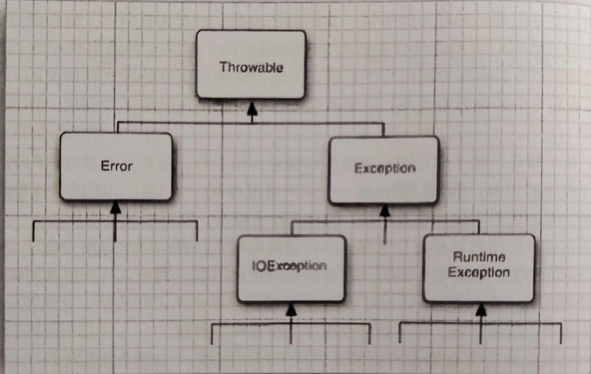

# 异常、断言和日志

---

## 4.1.1 异常分类
下图是一个异常层次结构的简化示意图。

需要注意的是，所有的异常都是由Throwable继承而来，但在这个层次结构中，下一层立即分为两个分支：Error和Exception。
Error类层次结构描述了Java运行时系统的内部错误和资源耗尽问题。你不应该抛出这种类型的对象。如果出现了这样的内部错误，除了通知用户，你几乎无能为力。
编程序时，要重点关注Exception层次结构。这个Exception层次结构又分为两个分支：一个分支派生于RuntimeException;另一个分支包括其它异常不继承这个类。

继承自RuntimeException的异常包括以下问题：
- 错误的强制类型转换。
- 越界的数组访问。
- 访问null指针。
不继承自RuntimeException的异常包括：
- 试图越过文件末尾继续读取数据。
- 试图打开一个不存在的文件。
- 试图根据给定的字符串查找Class对象，这个字符串表示的类不存在。

---

## 4.1.2 声明检查型异常
要在方法的首部指出这个方法可能抛出一个异常所以要修改方法首部，以反映这个方法可能抛出的检查型异常。例如：
`public FileInputStream(String name) throws FileNotFoundException`
如果发生错误，可能抛出 FileNotFoundException 异常。当发生这种错误时，构造器将不会初始化一个新的 FileInputStream 对象，而是抛出一个 FileNotFoundException 类对象。

编写方法时，不必给所有的方法throws，至于什么时候需要用throws子句声明异常，需要记住在遇到下面四种情况时会抛出异常：
- 调用了一个抛出检查型异常的方法。例如，FileInputStream构造器
- 检测到一个错误，并且利用throws语句抛出一个检查型异常。
- 程序出现错误。
- Java虚拟机或运行时库出现内部错误。
如果出现前两种情况，则必须告诉使用者可能抛出异常。
>如果一个方法可能有多个检查型异常，那么就列出所有的异常类。每个异常类之间用逗号隔开：
```
class MyAnimation{
    ...
    public Image loadImage(String s) throws FileNotFoundException, EOFException{
        ...
    }
}
```

---

## 4.1.3 如何抛出异常
假设在程序代码中读取java文件，文件首部承诺文件长度wei1024个字符`Content-length: 1024`。但是文件到732个字符就结束了。可以如下抛出这个异常：
`throw new EOFException()`
或者也可以写为：
`var e= new EOFException();
throw e;`
下面给出完整代码：
```
String readData(String n) throws EOFException{
    while(...){
        if(n.hasNext()){
            if(n<len){
                throw new EOFException();
            }
        }
        ...
    }
    return s;
}
```
如果一个已有的异常类能够满足你的要求，抛出这个异常非常容易，在这种情况下：
1. 找到一个合适的异常类。
2. 创建这个类的一个对象。
3. 将对象抛出。
一旦方法抛出了异常，这个方法就不会返回到调用者。

---

## 4.1.4 创建异常类
如果遇到任何标准异常类都无法描述清楚问题。在这种情况下，创建自己的异常类就显得重要。//我们要做的只是定义一个派生于Exception的类，或者派生于Exception的某个子类。自定义的这个类应该包含两个构造器，一个是默认的构造器，另一个是包含详细描述信息的构造器。

---

## 4.2.1 捕获异常概述
要想捕获一个异常，需要建立1try/catch语句块。：
```
try{
    code
    more code
}
catch(ExceptionType e){
    handler for this type
}
```
- 如果try语句块中的任何代码抛出了catch子句中指定的一个异常类，那么
1. 程序将跳过try语句块的其余代码。
2. 程序将执行catch子句中的处理器代码。
- 如果try语句块中的代码没有抛出任何异常，那么程序将跳过catch子句。
- 如果方法中任何代码抛出异常，但不是catch子句中指定的异常，那么这个方法会立即推出。

---

## 4.2.2 捕获多个异常
在一个try/catch语句中可以捕获多个异常类型。
```
try{
    code
}
catch(...){
    code
}
catch(...){
    code
}
catch(...){
    code
}
```
假如异常的动作是一样的，就可以合并catch子句：
```
try{
    ...
}
catch(FileNoteFoundException | UnknownHostException e){
    ...
}
```

---

## 4.2.3 再次抛出异常与异常链
可以在catch子句中抛出一个异常。通常，希望改变异常的类型时会这样做。如下：
```
try{
    access the database
}
catch(SQException e){
    throw new ServletException("database error:" + e.getMessage());
}
```
不过，还有一个更好的方法，可以把原始异常设置为新异常的“原因”：
```
try{
    access the database
}
catch(SQLException original){
    var e = new ServletException("database error");
    e.initCause(original);
    throw e;
}
```
捕获这个异常时，可以使用下面这条语句获取原始异常：
`Throwable original = caughtException.getCause();`

---

## 4.2.4 finally子句
代码抛出一个异常时，就会停止处理这个方法中的剩余代码。如果这个方法已经获得了只有它自己知道的一些本地资源，而这些资源必须清理，就会有问题。一种解决方案是捕获所有异常，完成资源的清理，再重新抛出异常。但是，这种解决方案比较繁琐，因为需要在两个地方清理资源分配，一个是正常代码中，另一个是在异常代码中。finally子句可以解决这个问题。
>在java7之后，还有一种更精巧的解决方案，即try-with-resources语句。try-with-resources语句可能比finally子句更常使用。
不管是否捕获到异常，finally子句中的代码都会执行。下面示例中，所有情况下程序都将关闭输入流。
```
var in = new FileInputStream(...);
try{
    //code that might throw exceptions
}
catch(IOException e){
    //show error message
}
finally{
    in.close();
}
```
下面来看这个程序执行finally子句的3种可能的情况：
1. 代码没有抛出异常。程序会执行try语句块中的代码，然后执行finally语句块的内容。
2. 代码抛出一个异常，并在一个catch子句中捕获。程序将会执行try中代码直到抛出异常为止。此时跳过try的剩余代码，转去执行该异常匹配的catch代码，然后执行finally子句中的代码。
3. 代码抛出一个异常。但没有任何catch子句捕获这个异常。程序将执行try语句块中的语句，直到抛出异常为止。此时跳过try的剩余代码，执行finally子句中的代码，并将异常抛回给这个方法的调用者。
>try语句可以只有finally语句，而没有catch子句。

---

## 4.2.5 try-with-Resources语句
对于以下代码模式：
```
open a resource
tyr{
    work with the resource
}
finally{
    close the resource
}
```
假设这个资源属于一个实现了AutoCloseable接口的类，Java7为这种代码模式提供了一个很有用的快捷方式。AutoCloseable接口有一个方法：
`void close() throws Exception`
try-with-resources语句（带资源的try语句）的最简形式为：
```
try(Reesource res = ...){
    work with res
}
```
try块退出时，会自动调用res.close()。
--下面会给出一个例子(读取一个文件中的所有单词)--
```
try(var in = new Scanner(Path.of("in.txt"),StandardCharsets.UTF_8);
    var out = new PrintWriter("out.txt",StandardCharsets.UTF_8)){
        while(in.hasNext()){
            out.println(in.next().toUpperCase());
        }
}
```
不论这个块如何退出，in和out都会关闭。如果用常规方式手动编程，就需要两个嵌套的try/finally语句。

---

## 4.2.6 分析栈轨迹元素
**栈轨迹**是程序执行过程中某个特定点上所有挂起的方法调用的一个列表。
可以使用Throwable类的printStackTrace方法访问栈轨迹的文本描述信息。
```
var t = new Throwable();
var out = new StringWriter();
t.printStackTrance(new PrintWriter(out));
String description = out.toString();
```
一种更灵活的方法是使用StackWalker类，它会生成一个StackWalker.StackFrame实例流，其中每个实例分别描述一个**栈帧**。可以利用以下调用迭代处理这些栈帧：
```
StackWalker walker = StackWalker.getInstancs();
walker.forEach(frame - > analyze frame)
```
如果想要以懒方式处理Stream<StackWalker.StackFrame>,可以调用：
`walker.walk(stream -> process stream)`

---

## 4.3 使用异常技巧
1. 异常处理不能代替简单的测试。
2. 不要过分的细化异常。
3. 合理利用异常参差结构。
4. 不要压制异常。
5. 在检测错误时，“苛刻”要比放任更好。
6. 不要羞于传递异常。
7. 使用标准方法报告null指针和越界异常。
8. 不要向最终用户显示栈轨迹。

---

## 4.4.1 断言的概念
假设你确信满足某个特定属性，并且代码依赖于这个属性。例如，可能需要计算
`double y = Math.sqrt(x);`
断言机制允许你在测试期间在代码中插入一些检查，而在生产代码中自动删除这些检查。
Java语言有一个关键字assert。这个关键字有两种形式：
`assert condintion;`
和
`assert condition : expression;`
这两个语句都会计算条件，如果结果为false则抛出一个AssertionError异常。第二个语句中，表达式将传入AssertionError对象的构造器，并转换成一个消息字符串。

>**表达式**部分的唯一目的就是生成一个消息字符串。

要想断言x是一个非负数，只需要使用下面这条语句
`assert x >=0;`
或者将x的具体值传递给AssertionError对象，以便以后显示。
`assert x >=0 :x;`

---

## 4.4.2 启用和禁用断言
在默认情况下，断言是禁用的。可以开启：
`java -enableassertions MyApp`
甚至可以在特定的类或整个包中启用断言，例如：
`java -ea:MyClass -ea:com.mycompany.mylib MyApp`
这条命令将为MyClass类以及com.mycompany.mylib包及其子包中的所有类打开断言。

---

## 4.4.3 使用断言完成参数检查
在Java语言中，提供了3种处理系统错误的机制：
- 抛出一个异常。
- 记录日志。
- 使用断言。
什么时候1应该选择使用断言呢？请记住下面几点：
- 断言失败是致命的、不可恢复的错误。
- 断言检查只在开发和测试阶段打开
>所以我们在这里就不过多叙述与断言有关的知识。

---

## 4.5.1 基本日志
对于简单的日志记录，可以使用全局日志记录器并调用其info方法：
`Logger.getGlobal().info("File->Open menu item selected");`
在默认情况下，会打印如下这个记录：
```
May 10,2013 10:12:15 PM LoggingImageViewer fileOpen
INFO: File->Open menu item selected
```
但是，如果在适当的地方（如main的最前面）调用
`Logger.getGlobal().setLevel(Level.OFF);`
将会抑制所有日志。

---

## 4.5.2 高级日志
在一个专业的应用程序中，肯定不想将所有的日志都记录到一个全局日志记录器中。你可以定义自己的日志记录器。
可以调用getLogger方法创建或获取一个日志记录器：
`private static final Logger myLogger = Logger.getLogger("com.mycompany.myapp");`
与包名类似，日志记录器名也有层次。如果对日志记录器"com.mycompany.myapp"设置了日志级别，它的子日志记录器也会继承这个级别。
通常，有以下7个日志级别：
- SEVERE
- WARNING
- INFO
- CONFIG
- FINE
- FINER
- FINEST
在默认情况下，实际上只记录前3个级别。也可以设置一个不同的级别，例如:
`logger.setLevel(Level.FINE);`
现在，会记录FINE以及所有更高级别的日志。
所有级别都有日志记录方法，如：
`logger.warning(message);`
或者，还可以使用log方法并指定级别:
`logger.log(Level.FINE,message);`
>记录日志的一个常见的用途是记录那些预料之外的异常。

可以使用下面两个便利方法在日志记录中记录包含异常的描述。
```
void throwing(String className,String methodName, Throwable t)
void log(Level l, String message, Throwable t)
```
典型的用法是：
```
if(...){
    var e = new IOException("...");
    logger.throwing("com.mycompany.mylib.Reader","read", e);
    throw e;
}
和
try{
    ...
}
catch(IOException e){
    Logger.getLogger("com.mycompany.myapp").log(Level.WARNING, "Reading image",e);
}
```
throwing调用可以记录一条FINER级别的日志记录和一个以THROW开头的消息。

---

## 4.5.3 修改日志管理器配置
可以通过编辑配置文件来修改日志系统的各个属性。默认配置文件位于：`jdk/conf/logging.properties`。
要想使用另一个配置文件，就要将`java.util.logging.confog.file`属性设置为那个文件的位置，为此要用以下命令启动你的程序：
`java -Djava.util.logging.config.file=configFile MainClass`
要想修改默认的日志级别，需要编辑配置文件，并修改下面这行设置：
`.level=INFO`
处理器也有级别。要想在控制台上看到FINE级别的消息，就需要如下设置：
`java.util.logging.ConsoleHandler.level=FINE`

在Java9中，可以用通过调用以下方法更新日志配置：
`LogManager.getLogManager().updateConfiguration(mapper)`

---

## 4.5.4 本地化
你可能希望日志消息本地化，以便全球用户都可以阅读。
本地化的应用程序包含**资源包**中的本地特定信息。资源包包含一组映射，分别对应各个本地化环境。
一个程序可以包含多个资源包，例如一个用于菜单，另一个用于日志消息。

请求一个日志记录器时，可以指定一个资源包：
`Logger logger = Logger.getLogger(LoggerName, "com.mycompany.logmessages");`
然后，为日志消息指定资源包的建，而不是具体的日志消息字符串：
`logger.info("readingFile");`

---

## 4.5.5 处理器
默认情况下，日志记录器将记录发送到ConsoleHander，它会将记录输出到System.err流。
与日志记录器一样，处理器也有日志级别。对于一个要记录的日志记录，它的日志级别必须高于日志记录器和处理器二者的阈值。日志管理配置文件默认的控制台处理器的日志级别设置为：
`java.util.logging.ConsoleHander.level=INFO`
要想记录FINE级别的日志，就必须修改配置文件中的默认日志记录器级别和处理器级别。或者，还可以绕过配置文件，安装你自己的处理器。
```
Logger logger = Logger.getLogger("com.mycompany.myapp");
logger.setLevel(Level.FINE);
logger.setUseParentHandlers(false);
var handler = new ConsoleHander();
hander.setLevel(Level.FINE);
logger.addHandler(handler);
```
要想将日志记录发送到其他地方，就要添加其他处理器。日志API为此提供了两个很有用的处理器，一个是FileHandler,另一个是SockeHandler。SockeHandler将记录发送到指定的主机和端口。而FileHandler可以将记录收录到一个文件中。
可以如下直接将记录发送到默认文件处理器：
```
var handler = new FileHandler();
logger.addHandler(handler);
```

也有可能不想使用默认的日志文件名，因此，应该使用另一种模式，例如，%h/myapp.log（有关模式变量的解释请参见表7-2）

- 如果多个应用程序（或者同一个应用程序的多个副本）使用同一个日志文件，就应该打开append标志。或者，应该在文件名模式中使用%u，这样每个应用程序会创建日志的唯一副本。

- 打开文件循环功能也是一个不错的主意。只要文件超出了限制大小，最老的文件就会被删除，其他的文件将重新命名，同时创建一个新文件，其生成编号为0.
- 还可以通过扩展Handler类或StreamHandler类自定义处理器。这个处理器将会在一个窗口中显示日志记录。（使用这种方式只有一个问题，就是处理器会缓存记录，并且只有在缓冲区满的时候才将它们写入流中。因此，需要覆盖publish方法，使得处理器获得每个记录之后就会刷新输出缓冲区。）

---

## 4.5.6 过滤器
在默认情况下，会根据日志记录的级别进行过滤。每个日志记录器和处理器都可以有一个可选的过滤器来完成额外的过滤。要定义一个过滤器，需要实现Filter接口并定义以下方法：
`boolean isLoggable(LogRecord record)`
要想将一个过滤器安装到一个日志记录器或处理器中，只需要调用setFilter方法。注意，一次最多只能由一个过滤器。

---

## 4.6 日志技巧
1. 对一个简单的应用，选择一个日志记录器。
2. 默认的日志配置会把级别等于或高于INFO的所有消息记录到控制台。
3. FINE级别是一个很好的选择。

---

## 4.7 调试技巧
1. 可以用下面代码打印或记录任何变量的值：
`System.out.println("x="+x);`
或
`Logger.getGlobal().info("x="+x);`
2. 可以在每个类中放一个独立的main方法，这样就可以提供一个单元测试桩，允许你独立地测试类。
3. 可以看[JUnit](http://junit.org)。它是一个非常流行的单元测试框架。
4. 日志代理是一个子类对象，它可以截获方法调用，将这些调用记入日志，然后调用超类中的方法。
5. 利用Throwable类的printStackTrace方法，可以从任意的异常对象获得栈轨迹。
6. 一般来说，栈轨迹显示在System.err上，如果想要记录或显示栈轨迹，可以如下将它捕获到一个字符串中:
```
var out = new StringWriter();
new Throwable().printStackTrace(new PrintWriter(out));
String description = out.toString();
```
7. 通常，将程序错误计入一个文件会很有用。
8. 在System.err中显示为捕获的异常的栈轨迹并不是一个理想的方法
9. 要想观察类的加载过程，启动Java虚拟机时可以使用 -verbose标志。
10.  -XLint选项告诉编译器找出常见的代码问题。
11.  Java虚拟机提供了对Java应用的**监控**和**管理**支持，允许在虚拟机中安装代理来跟踪内存消耗、线程使用、类加载等情况。
12.  Java任务管理器是一个专业级性能分析和诊断工具，可以从[ADOPTIUM](https://adoptopenjdk.net/jmc.html)得到